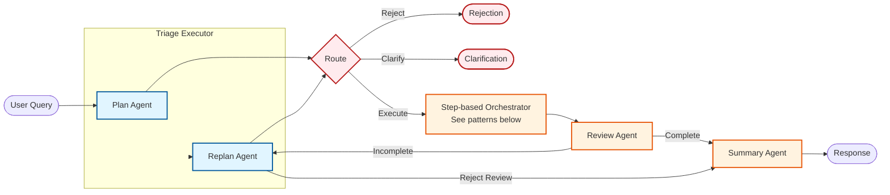

# fast-azure-agent-app

**Production-ready multi-agent app in ChatGPT style, using Azure Stack**

[](https://github.com/wqeqwqeq/fast-azure-agent-app)

## Demo

[](https://www.youtube.com/watch?v=uqrNaFS9uqM)

## Why This Project

Whether you're using **Microsoft Agent Framework**, **LangGraph**, or **OpenAI Agent SDK**, the getting-started experience is remarkably similar:

```python
# Define your tools
@tool
def search_database(query: str) -> str:
    return db.search(query)

# Create your agent
agent = Agent(
    model="gpt-4",
    tools=[search_database],
    system_prompt="You are a helpful assistant..."
)

# Run it
response = agent.run("Find all orders from last week")
print(response)
```

In under 20 lines of code, you have a working AI agent. The abstractions are elegant. You can go from zero to "agent printing to console" in minutes.

**But here's what nobody tells you:**

The moment you want to turn this into a real chat application—something your users can actually interact with, like ChatGPT—you suddenly face a mountain of engineering challenges:

- **How do I stream responses in real-time?** Users expect to see tokens appear as they're generated
- **Where do I store conversation history?** And how do I make it fast enough for real-time chat?
- **What happens when conversations get long?** Context windows have limits
- **How do I show users what the agent is doing?** When it's thinking, calling tools, processing results
- **How do I handle authentication?** Multiple users, multiple conversations, data isolation
- **How do I observe what's happening in production?** When something goes wrong at 3 AM
- **What if I need multiple agents working together?** How do I orchestrate workflows?

Each of these is a substantial engineering project. Together, they represent weeks or months of work.

---

This project provides all that infrastructure out-of-the-box. You focus only on:
- **Prompt engineering** - Define your agent's behavior
- **Tool implementation** - Write the functions your agents call

**Think of it as cookiecutter for AI agents**—but instead of filling out a config file, you have a conversation. Run `/onboard` in Claude Code, describe your domain and agents in natural language, and get working code generated automatically.

## Features

- **Chat UI** - Conversation history, model selection, thinking panel
- **Multi-agent Workflows** - Triage (classification routing) and Dynamic (flexible orchestration) modes
- **Chat History** - PostgreSQL + Redis write-through caching
- **Memory** - Rolling window + LLM summarization for long conversations
- **Observability** - Azure Application Insights / local Aspire dashboard
- **Authentication** - Azure App Service Easy Auth
- **SSE Streaming** - Real-time agent execution feedback
- **Claude Code Skills** - Rapid agent scaffolding via `/onboard`

## Architecture

**Tech Stack:** FastAPI | Azure PostgreSQL | Azure Redis | Microsoft Agent Framework | Azure OpenAI

### Azure Architecture


---

### Workflow Diagrams

#### Triage Workflow


#### Dynamic Workflow



**Key Differences:**
| Feature | Triage Workflow | Dynamic Workflow |
|---------|-----------------|------------------|
| Routing | Classification-based | Plan/Replan agents |
| Execution | All parallel fan-out | Step-based (sequential/parallel) |
| Review | None | Review Agent checks completeness |
| Iteration | Single pass | Loop with max_iterations=10 |

---

### Storage Strategy (Write-Through Cache)

#### Write Flow


#### Read Flow


**Write-Through Pattern:**
1. **Write Path**: All writes go to PostgreSQL first (source of truth), then update Redis cache
2. **Read Path**: Check Redis first → on cache miss, read from PostgreSQL and populate cache
3. **TTL**: Redis cache expires after 30 minutes to prevent stale data

---

### Memory Design

See [Memory Agent Design](app/memory_agent/design.md) for detailed sliding window summarization algorithm and simulation.

## Quick Start

### 1. Deploy Azure Infrastructure

```bash
# Create resource group
./deployment/deploy_infra.sh rg

# Deploy full infrastructure
./deployment/deploy_infra.sh app --postgres-password <your-password>

# Initialize database
./deployment/deploy_script.sh db <your-password>
```

### 2. Configure Key Vault

- Add access policy for your identity
- Set `AZURE-OPENAI-API-KEY` secret

### 3. Local Development

```bash
# Install dependencies
uv sync

# Copy environment config
cp env.example .env

# Enable demo mode for testing
# Set USE_DEMO_OPSAGENT=true in .env

# Run development server
uv run uvicorn app.main:app --reload
```

### 4. Create Your Agent

```bash
# In Claude Code, run:
/onboard

# Follow prompts to describe your domain and agents
# Set USE_DEMO_OPSAGENT=false in .env
```

### 5. Build & Deploy

```bash
./deployment/build_docker.sh
# Push to ACR and deploy
```

## Create Your Agent with `/onboard`

The `/onboard` skill guides you through agent creation:

1. Run `/onboard` in Claude Code
2. Answer questions about your domain and required agents
3. Get generated files:
   - Sub-agent configurations
   - Tool stubs
   - 6 orchestration prompts
4. Implement your tool logic
5. Run and iterate

## Project Structure

```
app/
├── core/           # Internal building blocks (SSE utilities)
├── infrastructure/ # External services (PostgreSQL, Redis, Key Vault)
├── routes/         # FastAPI endpoints
├── schemas/        # Pydantic models
├── agent_factory/  # Agent framework (/onboard generates code here)
│   ├── agents/     # Agent implementations
│   ├── workflows/  # Triage & dynamic workflows
│   ├── prompts/    # System prompts
│   ├── factory.py  # Creates agents from config
│   └── subagent_registry.py  # Agent registration
├── opsagent/       # Demo agent (reference implementation)
├── memory_agent/   # Conversation memory management
├── dependencies.py # Dependency injection
└── config.py       # Environment configuration
```

## Configuration

| Variable | Description | Default |
|----------|-------------|---------|
| `RESOURCE_PREFIX` | Azure service name prefix | - |
| `CHAT_HISTORY_MODE` | Storage: `local`, `postgres`, `redis` | `local` |
| `DYNAMIC_PLAN` | Enable dynamic workflow | `false` |
| `USE_DEMO_OPSAGENT` | Use demo agent for testing | `false` |
| `MEMORY_ROLLING_WINDOW` | Recent messages to keep | `14` |
| `MEMORY_SUMMARIZE_THRESHOLD` | Start summarizing after N rounds | `4` |
| `SHOW_FUNC_RESULT` | Show function args/results in UI | `false` |

## Development Commands

```bash
# Install dependencies
uv sync

# Run development server
uv run uvicorn app.main:app --reload

# Add package
uv add <package-name>

# Run production
uv run uvicorn app.main:app --host 0.0.0.0 --port 8000
```

## Deployment

```bash
# Deploy infrastructure
./deployment/deploy_infra.sh rg              # Resource group only
./deployment/deploy_infra.sh app --postgres-password <password>

# Build container
./deployment/build_container.sh

# Deploy application
./deployment/deploy_script.sh
```
