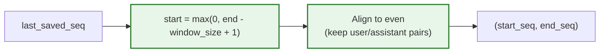
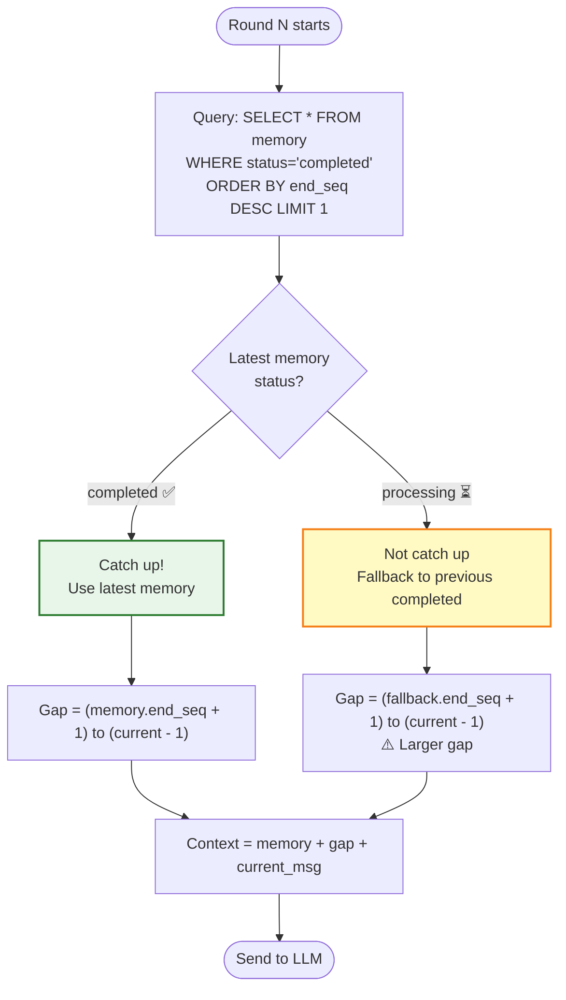
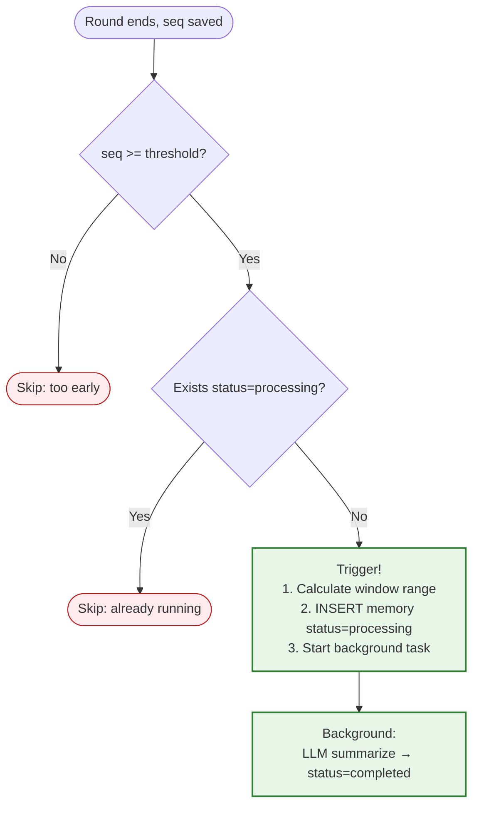

# Memory Agent Design

## High-Level Flow

```mermaid
graph TB
    subgraph "Round START"
        A1([User sends message]) --> A2{Has completed<br/>memory?}
        A2 -->|Yes| A3[Get latest completed memory]
        A2 -->|No| A4[Use raw messages]
        A3 --> A5[Calculate gap messages]
        A5 --> A6["Context = memory + gap + current"]
        A4 --> A6
        A6 --> A7([Send to LLM])
    end

    subgraph "Round END"
        B1([Assistant responds]) --> B2[Save message to DB]
        B2 --> B3{seq >= threshold<br/>AND no processing?}
        B3 -->|Yes| B4[Calculate sliding window]
        B3 -->|No| B5([Skip])
        B4 --> B6["Insert memory<br/>(status=processing)"]
        B6 --> B7[Background: LLM summarize]
        B7 --> B8["Update status=completed"]
    end

    classDef startClass fill:#e1f5ff,stroke:#01579b,stroke-width:2px
    classDef endClass fill:#fff3e0,stroke:#e65100,stroke-width:2px
    classDef decisionClass fill:#ffebee,stroke:#b71c1c,stroke-width:2px

    class A1,A7 startClass
    class B1,B5 endClass
    class A2,B3 decisionClass
```



---

## Sliding Window Calculation



**Examples (window_size=14):**

| last_saved_seq | Calculation | Range | Window Status |
|----------------|-------------|-------|---------------|
| 5 | max(0, 5-14+1) = 0 | (0, 5) | Not full, 6 msgs |
| 13 | max(0, 13-14+1) = 0 | (0, 13) | Exactly full, 14 msgs |
| 15 | max(0, 15-14+1) = 2 | (2, 15) | Sliding! Drop seq 0-1 |
| 19 | max(0, 19-14+1) = 6 | (6, 19) | Sliding! Drop seq 0-5 |

---

## Read Flow: Catch-up vs Not Catch-up



---

## Write Flow: Trigger Condition



---

## Full Simulation: Round 1-10 (Mixed Catch-up/Not Catch-up)

### Round 1-2: Accumulation Phase
```
Round 1 ends: seq 0-1, no trigger
Round 2 ends: seq 0-3, no trigger
Memory table: empty
```

---

### Round 3 Ends: First Trigger
```
Round 3 ends:
├─ messages: seq 0-5
├─ trigger summary: ✅ background task seq 0-5 (Round 1-3)
└─ Memory table:
   | id | start_seq | end_seq | base_id | status     |
   |----|-----------|---------|---------|------------|
   | 1  | 0         | 5       | null    | processing |
```

---

### Round 4: ✅ Caught up
```
Assumption: User paused to think, id=1 completed before Round 4 started

Round 4 starts:
├─ read memory: id=1 completed ✅ caught up!
├─ context = memory(seq 0-5) + current question
└─ send to LLM:
   ┌─────────────────────────────────────────────────────┐
   │ <memory>                                            │
   │ [Summary of Round 1-3]:                             │
   │ User discussed Python project architecture,         │
   │ chose FastAPI + PostgreSQL.                         │
   │ </memory>                                           │
   │                                                     │
   │ User: Round 4 question  ← current, no gap           │
   └─────────────────────────────────────────────────────┘

Round 4 ends:
├─ messages: seq 0-7
├─ trigger summary: ✅ background task seq 0-7 (Round 1-4)
└─ Memory table:
   | id | start_seq | end_seq | base_id | status     |
   |----|-----------|---------|---------|------------|
   | 1  | 0         | 5       | null    | completed  |
   | 2  | 0         | 7       | 1       | processing |
```

---

### Round 5: ❌ Not caught up
```
Assumption: User sent message immediately, id=2 not yet completed

Round 5 starts:
├─ read memory: id=2 processing, fallback to id=1 (end_seq=5)
├─ gap = seq 6-7 (Round 4)
├─ context = memory(id=1) + gap + current question
└─ send to LLM:
   ┌─────────────────────────────────────────────────────┐
   │ <memory>                                            │
   │ [Summary of Round 1-3]:                             │
   │ User discussed Python project architecture,         │
   │ chose FastAPI + PostgreSQL.                         │
   │ </memory>                                           │
   │                                                     │
   │ User: Round 4 question      ← gap                   │
   │ Assistant: Round 4 answer                           │
   │ User: Round 5 question      ← current               │
   └─────────────────────────────────────────────────────┘

Round 5 ends:
├─ messages: seq 0-9
├─ trigger summary: ❌ (id=2 still processing, skip)
└─ Memory table: unchanged
```

---

### Round 6: ✅ Caught up
```
Assumption: id=2 completed before Round 6 started

Round 6 starts:
├─ read memory: id=2 completed ✅
├─ gap = seq 8-9 (Round 5)
├─ context = memory(id=2) + gap + current question
└─ send to LLM:
   ┌─────────────────────────────────────────────────────┐
   │ <memory>                                            │
   │ [Summary of Round 1-4]:                             │
   │ Discussed Python architecture, chose FastAPI +      │
   │ PostgreSQL. Designed user table schema.             │
   │ </memory>                                           │
   │                                                     │
   │ User: Round 5 question      ← gap                   │
   │ Assistant: Round 5 answer                           │
   │ User: Round 6 question      ← current               │
   └─────────────────────────────────────────────────────┘

Round 6 ends:
├─ messages: seq 0-11
├─ trigger summary: ✅ seq 0-11 (Round 1-6)
└─ Memory table:
   | id | start_seq | end_seq | base_id | status     |
   |----|-----------|---------|---------|------------|
   | 1  | 0         | 5       | null    | completed  |
   | 2  | 0         | 7       | 1       | completed  |
   | 3  | 0         | 11      | 2       | processing |
```

---

### Round 7: ❌ Not caught up
```
Round 7 starts:
├─ read memory: id=3 processing, fallback to id=2 (end_seq=7)
├─ gap = seq 8-11 (Round 5-6)
└─ send to LLM:
   ┌─────────────────────────────────────────────────────┐
   │ <memory>                                            │
   │ [Summary of Round 1-4]                              │
   │ </memory>                                           │
   │                                                     │
   │ User: Round 5 question      ← gap start             │
   │ Assistant: Round 5 answer                           │
   │ User: Round 6 question                              │
   │ Assistant: Round 6 answer   ← gap end               │
   │ User: Round 7 question      ← current               │
   └─────────────────────────────────────────────────────┘

Round 7 ends:
├─ messages: seq 0-13
├─ trigger summary: ❌ (id=3 still processing)
└─ Memory table: unchanged
```

---

### Round 8: ✅ Caught up
```
Assumption: id=3 completed

Round 8 starts:
├─ read memory: id=3 completed (end_seq=11) ✅
├─ gap = seq 12-13 (Round 7)
└─ send to LLM:
   ┌─────────────────────────────────────────────────────┐
   │ <memory>                                            │
   │ [Summary of Round 1-6]:                             │
   │ Discussed Python architecture, chose FastAPI +      │
   │ PostgreSQL. Designed user & order tables.           │
   │ Discussed indexing strategy.                        │
   │ </memory>                                           │
   │                                                     │
   │ User: Round 7 question      ← gap                   │
   │ Assistant: Round 7 answer                           │
   │ User: Round 8 question      ← current               │
   └─────────────────────────────────────────────────────┘

Round 8 ends:
├─ messages: seq 0-15
├─ calc window: end_seq=15, window=14, start_seq = max(0, 15-14+1) = 2
├─ trigger summary: ✅ seq 2-15 (Round 2-8) 🔴 sliding starts!
└─ Memory table:
   | id | start_seq | end_seq | base_id | status     |
   |----|-----------|---------|---------|------------|
   | 3  | 0         | 11      | 2       | completed  |
   | 4  | 2         | 15      | 3       | processing |
           ↑
         Round 1 dropped
```

---

### Round 9: ❌ Not caught up
```
Round 9 starts:
├─ read memory: id=4 processing, fallback to id=3 (end_seq=11)
├─ gap = seq 12-15 (Round 7-8)
└─ send to LLM:
   ┌─────────────────────────────────────────────────────┐
   │ <memory>                                            │
   │ [Summary of Round 1-6] ← still has Round 1          │
   │ </memory>                                           │
   │                                                     │
   │ User: Round 7 question      ← gap                   │
   │ Assistant: Round 7 answer                           │
   │ User: Round 8 question                              │
   │ Assistant: Round 8 answer                           │
   │ User: Round 9 question      ← current               │
   └─────────────────────────────────────────────────────┘

Round 9 ends:
├─ messages: seq 0-17
├─ trigger summary: ❌ (id=4 still processing)
└─ Memory table: unchanged
```

---

### Round 10: ✅ Caught up
```
Assumption: id=4 completed

Round 10 starts:
├─ read memory: id=4 completed (seq 2-15) ✅
├─ gap = seq 16-17 (Round 9)
└─ send to LLM:
   ┌─────────────────────────────────────────────────────┐
   │ <memory>                                            │
   │ [Summary of Round 2-8]: ← Round 1 is gone!          │
   │ Chose FastAPI + PostgreSQL. Designed user & order   │
   │ tables. Discussed indexing, auth, deployment.       │
   │ </memory>                                           │
   │                                                     │
   │ User: Round 9 question      ← gap                   │
   │ Assistant: Round 9 answer                           │
   │ User: Round 10 question     ← current               │
   └─────────────────────────────────────────────────────┘

Round 10 ends:
├─ messages: seq 0-19
├─ calc window: end_seq=19, start_seq = max(0, 19-14+1) = 6
├─ trigger summary: ✅ seq 6-19 (Round 4-10) 🔴 continues sliding
└─ Memory table:
   | id | start_seq | end_seq | base_id | status     |
   |----|-----------|---------|---------|------------|
   | 3  | 0         | 11      | 2       | completed  |
   | 4  | 2         | 15      | 3       | completed  |
   | 5  | 6         | 19      | 4       | processing |
           ↑
         Round 1-3 all dropped
```

---

## Memory Table Final State
```
| id | start_seq | end_seq | base_id | Coverage     | Note              |
|----|-----------|---------|---------|--------------|-------------------|
| 1  | 0         | 5       | null    | Round 1-3    | Initial           |
| 2  | 0         | 7       | 1       | Round 1-4    | Extend            |
| 3  | 0         | 11      | 2       | Round 1-6    | Extend            |
| 4  | 2         | 15      | 3       | Round 2-8    | 🔴 Slide, drop R1 |
| 5  | 6         | 19      | 4       | Round 4-10   | 🔴 Slide, drop R1-3 |
```

---

## Timeline Overview
```
Round │ Memory Used at START  │ Trigger at END        │ Caught up?
──────┼───────────────────────┼───────────────────────┼───────────
  3   │ None                  │ id=1 (0-5)            │ -
  4   │ id=1 ✅               │ id=2 (0-7)            │ ✅ Yes
  5   │ id=1 + gap            │ Skip                  │ ❌ No
  6   │ id=2 ✅               │ id=3 (0-11)           │ ✅ Yes
  7   │ id=2 + gap            │ Skip                  │ ❌ No
  8   │ id=3 ✅               │ id=4 (2-15) 🔴        │ ✅ Yes
  9   │ id=3 + gap            │ Skip                  │ ❌ No
  10  │ id=4 ✅               │ id=5 (6-19) 🔴        │ ✅ Yes
```

---

## Sliding Window Visualization
```
id=3: [R1][R2][R3][R4][R5][R6]
      [████████████████████████]  seq 0-11

id=4:     [R2][R3][R4][R5][R6][R7][R8]
       ✂️ [████████████████████████████]  seq 2-15
       ↑ R1 dropped

id=5:             [R4][R5][R6][R7][R8][R9][R10]
               ✂️ [████████████████████████████]  seq 6-19
               ↑ R1-R3 dropped
```

---

## Key Design Points

1. **Database-based concurrency**: `status` field prevents duplicate background tasks
2. **Version chain**: `base_memory_id` enables incremental summarization & audit
3. **Graceful degradation**: If latest not ready, fallback to previous completed + larger gap
4. **Sliding window**: Constant memory size regardless of conversation length
5. **Non-blocking**: Background `asyncio.create_task()` for summarization
