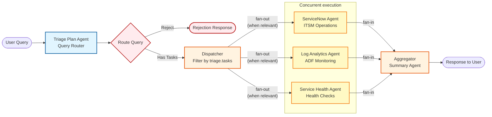
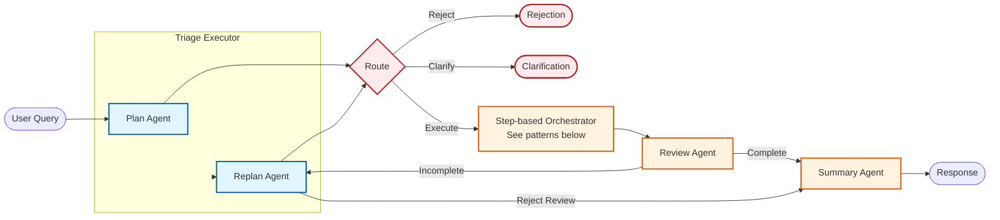
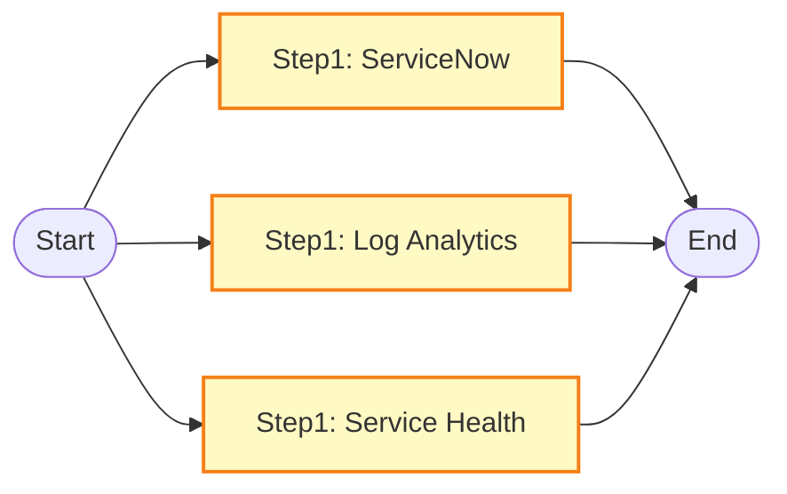
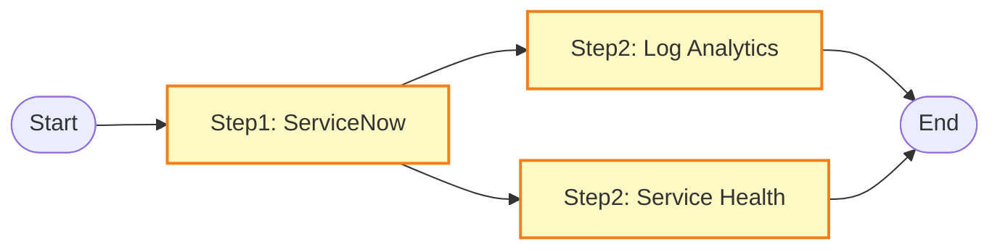
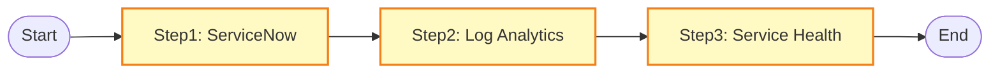
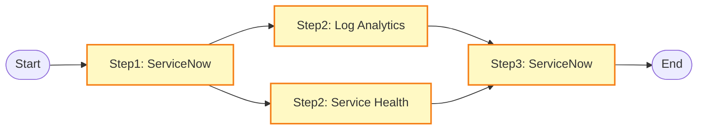
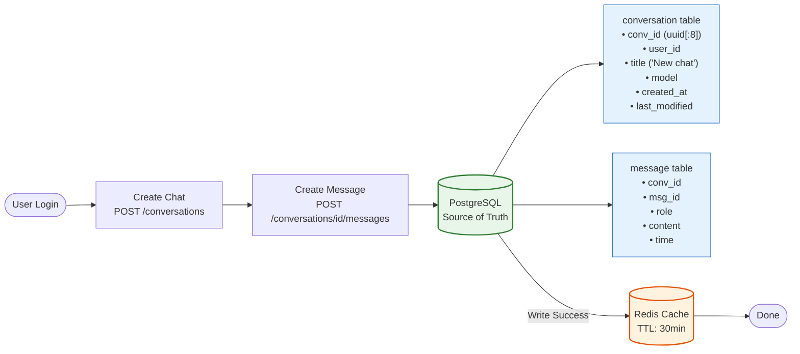
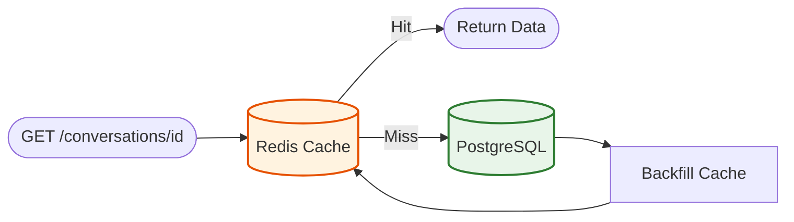

## triage_workflow

---

## dynamic_workflow

### Examples of Step-based Execution Patterns (determined by Plan/Replan Agent)

**Pattern A: All Parallel**

**Pattern B: Sequential then Parallel**

**Pattern C: All Sequential**

**Pattern D: Sequential → Parallel → Sequential**

And more...

**Key Differences from triage_workflow:**
1. **Triage Executor** handles both Plan (initial) and Replan (after review) modes
2. **Orchestrator** executes steps sequentially, tasks within same step run in parallel
3. **Review Agent** checks if results fully answer the query
4. **Review Loop** - if incomplete, sends back to Triage for replan decision
5. **Triage can reject review** - if review feedback is invalid, skip retry and go to Summary
6. **max_iterations=10** prevents infinite loops

---

## write_through_cache

### Write Flow

### Read Flow

**Return Fields:**
| Field | Description |
|-------|-------------|
| `id` | conversation_id |
| `title` | chat title |
| `model` | LLM model |
| `created_at` | creation timestamp |
| `last_modified` | last update timestamp |
| `agent_level_llm_overwrite` | optional LLM override |
| `messages[]` | array of `{role, content, time}` |

**Write-Through Pattern:**
1. **Write Path**: All writes go to PostgreSQL first (source of truth), then update Redis cache
2. **Read Path**: Check Redis first → on cache miss, read from PostgreSQL and populate cache
3. **TTL**: Redis cache expires after 30 minutes to prevent stale data

| Table | Fields |
|-------|--------|
| **conversation** | `conversation_id`, `user_id`, `title`, `model`, `created_at`, `last_modified` |
| **message** | `conversation_id`, `message_id`, `role`, `content`, `time` |

